# Healthcare Supply Chain

## UML Diagrams

### Activity Diagram
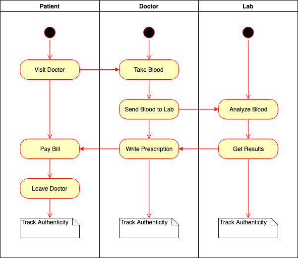

### Sequence Diagram

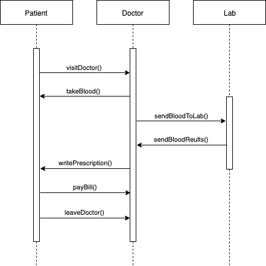

### State Diagram

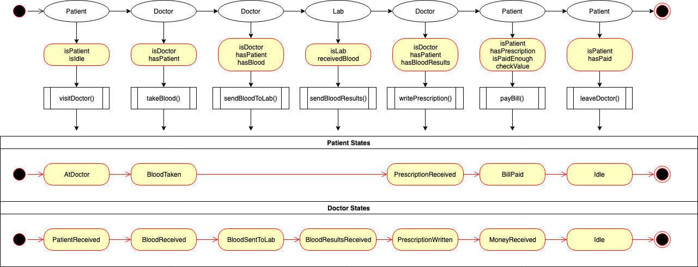

### Classes (Data Model) Diagram

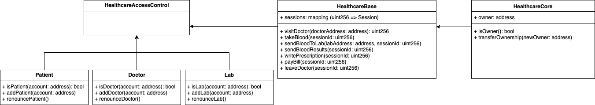

## Libraries

We have used a `Roles.sol` library for managing addresses assigned to a Role,
taken from: [OpenZeppelin](https://github.com/OpenZeppelin/openzeppelin-solidity/blob/master/contracts/access/Roles.sol).

## IPFS

We have not used IPFS in this project.

## General Write Up

### Installation

From the main project directory run:

```
npm install
```

### Deploying to Local Development Network

Start the local development network:

```
ganache-cli -m "famous hammer average again hurt warrior fiction pool steel patrol cigar nature"
```

These are the available development accounts:

```
Available Accounts
==================
(0) 0x38fe57b50464e61387c416fc4b058fde1db29570 (~100 ETH)
(1) 0xf67a3cc3add066b283a2995d82ac132ddb8dc1e2 (~100 ETH)
(2) 0x27de43a88d853bf8a093961f69557032b8be2e5a (~100 ETH)
(3) 0x979101a0351e7a388f87eaa66fa75373331a6257 (~100 ETH)
(4) 0x84f22a7d2054bcc9592b578aa2c3f0739c8d4f05 (~100 ETH)
(5) 0x8a984017bbed06c288729da13c8306b77a65cfe2 (~100 ETH)
(6) 0x051e2eca973f4f49fdc90f334063e01ed4910cd4 (~100 ETH)
(7) 0x7137d1d367a005ec7d853f7a81afd4b87fd64b6a (~100 ETH)
(8) 0xfd45684acf8d69d36a545fc09b2578dd1c74972d (~100 ETH)
(9) 0x107526407e1f90bf376090d2f9caa14d1a28d275 (~100 ETH)
```

In the following, we use:

* Account `(0)` is used as the contract owner account.
* Accounts `(1)` and `(2)` are used as patient accounts.
* Accounts `(3)` and `(4)` are used as doctor accounts.
* Accounts `(5)` and `(6)` are used as lab accounts.

You can run migration scripts and unit tests as follows:

```
truffle migrate
truffle test
```

Instead of unit tests, you can also hand test the DApp locally by running:

```
npm run dev
```

The main workflow is as follows:

#### Set Role Accounts

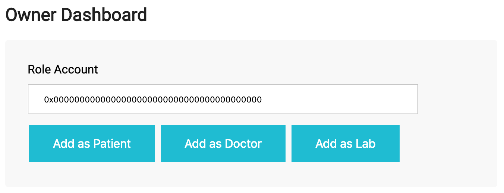

Here you can set patient, doctor, and lab accounts.

#### Visit Doctor

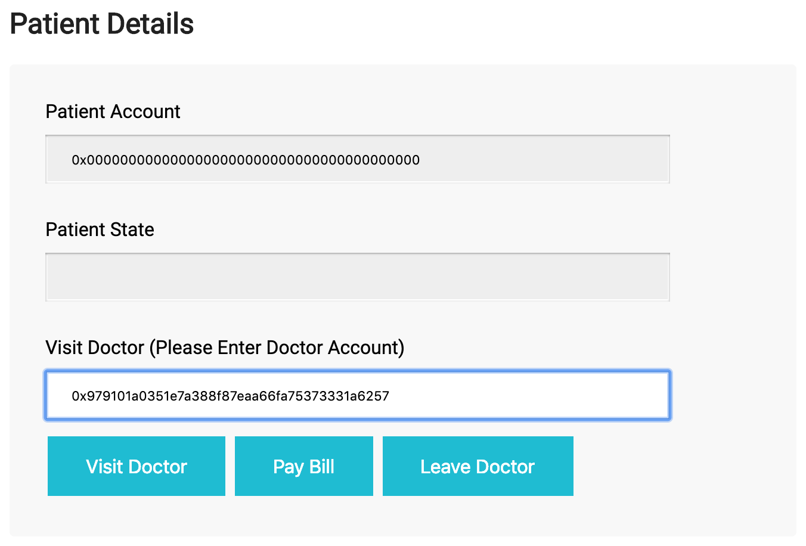

First, (from a patient account) you need to visit a doctor. Enter the
corresponding doctor account and click on the `Visit Doctor` button.

This action will create a new active session:

#### Session Created

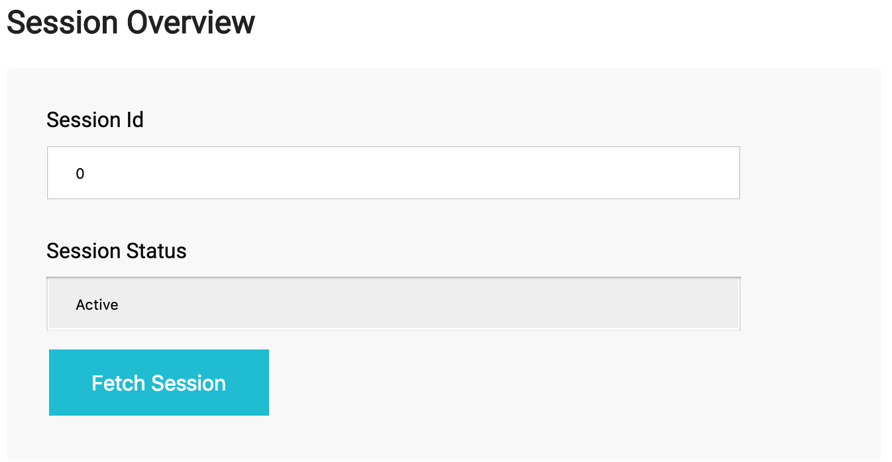

#### Take Blood

Next, (from the doctor account) you can take patient's blood. Click on the
`Take Blood` button.

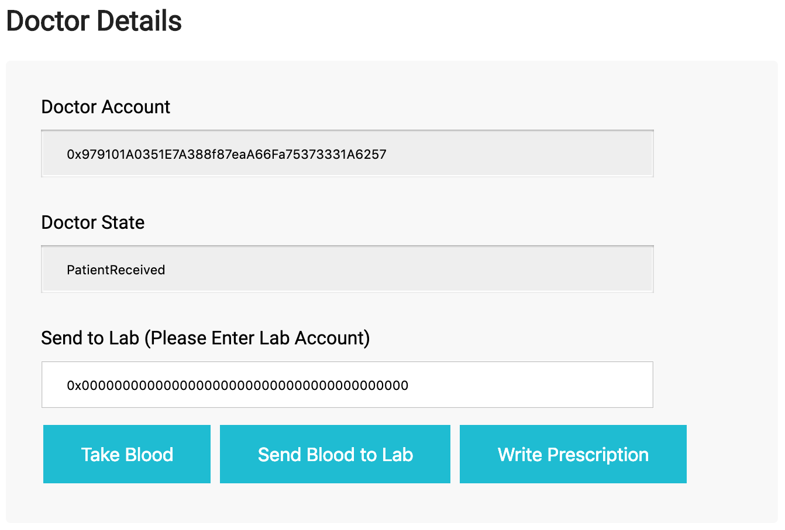

#### Send Blood to Lab

Next, (from the same doctor account) you can send the blood to a lab. Enter
the corresponding lab account and click on the `Send Blood to Lab` button.

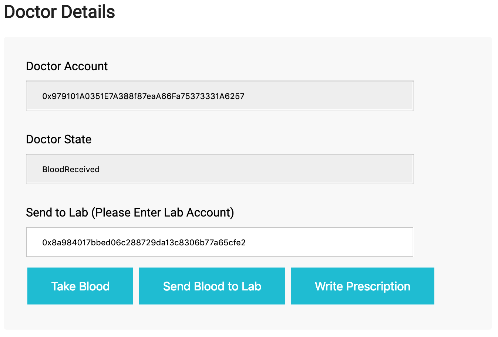

#### Send Blood Results

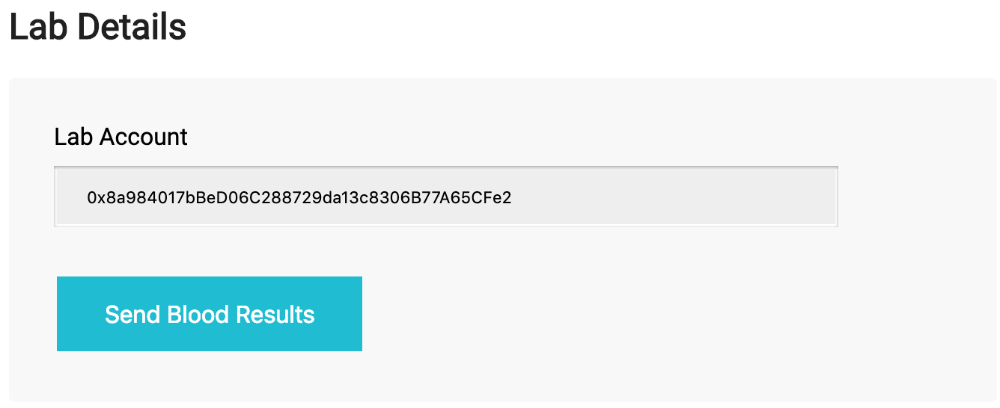

Next, (from the lab account) you can send the blood results back to the doctor.
Click on the `Send Blood Results` button.

#### Write Prescription

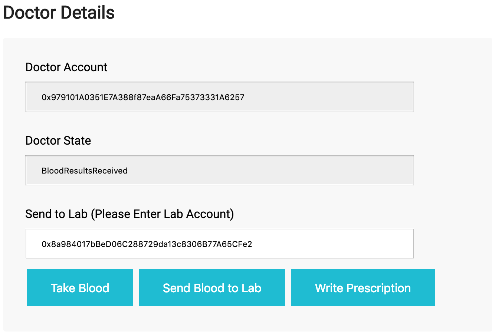

Next, (from the doctor account) you can write a prescription to the patient.
Click on the `Write Prescription` button.

#### Pay Bill and Leave

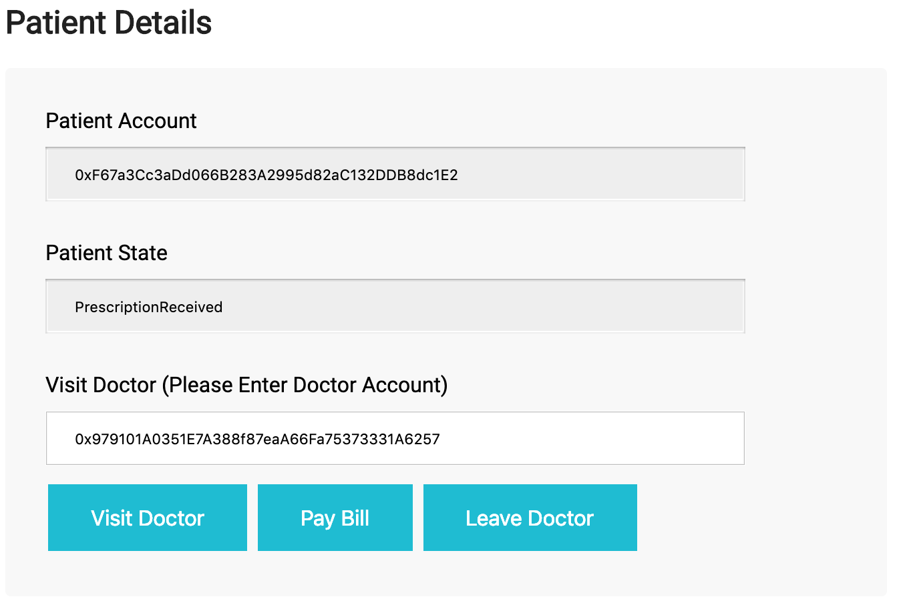

Finally, (from the patient account) you can pay the bill for the prescription
and leave the doctor. Click on the `Pay Bill` button, and the on the
`Leave Doctor` button.

#### Session Terminated

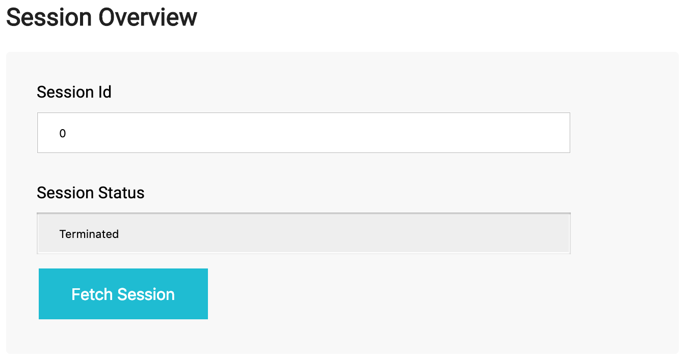

Leaving a doctor will terminate the session. You can fetch this session at any
time in the future.

#### Transaction History

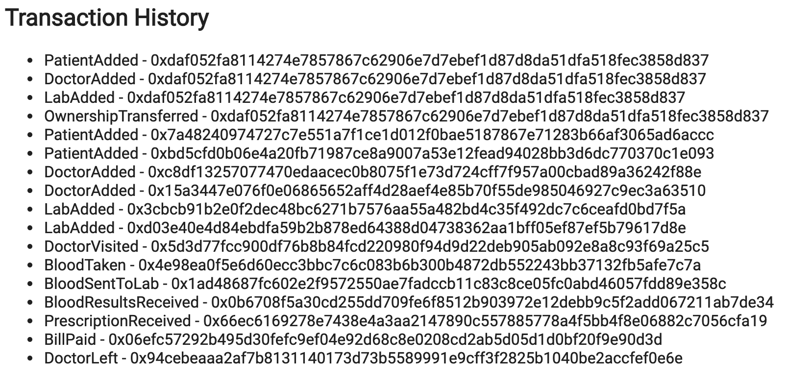

Here you can see the full transaction history across all sessions.

## Deploying to Rinkeby

You can deploy the contract to Rinkeby network (already done) as follows:

```
truffle migrate --network rinkeby
```

Contract: `0x9c39ea03FF7d09dDA049a77f9609f78e7D060472`

Rinkeby Etherscan [link](https://rinkeby.etherscan.io/address/0x9c39ea03FF7d09dDA049a77f9609f78e7D060472).

For convenience, we have already added some role accounts (as described above).