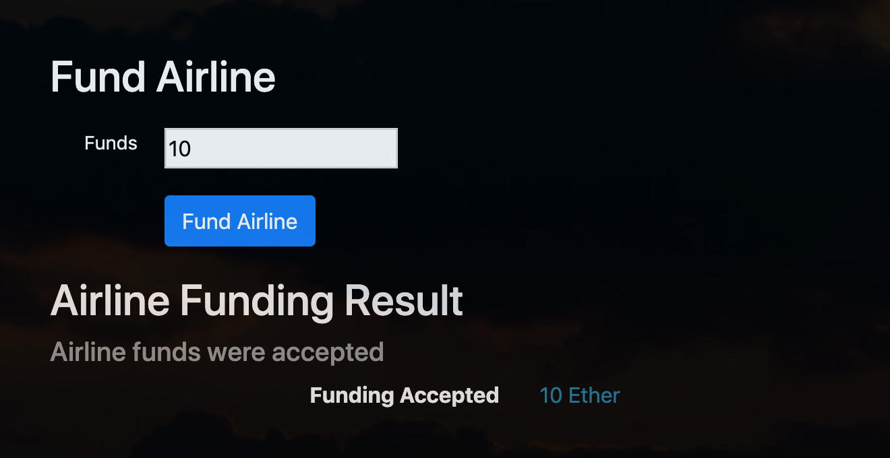

# FlightSurety

FlightSurety is a sample flight insurance application project for
Udacity Blockchain nanodegree course.

## Installation

From the main project directory run:

```
npm install
```

## Unit Testing on Local Development Network

Start the local development network:

```
ganache-cli -a 50
```

Run the unit tests as follows:

```
truffle test ./test/flightSuretyStopLoss.js
truffle test ./test/flightSuretyData.js
truffle test ./test/flightSuretyApp.js
```

## Deploying to Local Development Network

Start the local development network:

```
ganache-cli -a 50 -m 'famous hammer average again hurt warrior fiction pool steel patrol cigar nature'
```

**NOTE**: You need to use the above mnemonic in order for server to work
properly.

Run the migration scripts as follows:

```
truffle migrate
```

The first account:

```
(0) 0x38fe57b50464e61387c416fc4b058fde1db29570
```

Is the contract owner account of both the `FlightSuretyApp` and
`FlightSuretyData` contracts.

The migration script automatically connects these two contracts and registers
the first (Swiss) airline:

```
(1) 0xf67a3cc3add066b283a2995d82ac132ddb8dc1e2 Swiss
```

And two Swiss flights:

```
LX1484 ZRH -> PRG
LX1487 PRG -> ZRH
```

### Starting DApp

```
npm run dapp
```

To view the DApp visit:

`http://localhost:8000`

If everything works, you should see the following:


### Starting Server

```
npm run server
```

If everything works, you should see the following console output:


By default, 30 oracles are registered upon startup.

## DApp Guide

### Airline Registration

Enter the address and the name of the new (to be registered) airline, e.g.:

```
(2) 0x27de43a88d853bf8a093961f69557032b8be2e5a Lufthansa
```

And then click on the "Register Airline" button.


**NOTE**: You can only register (vote to register) a new airline from an
already registered (and funded) airline account.

### Airline Funding

Enter the funds (`10 Ether`) and click on the "Fund Airline" button.



### Flight Registration

Airline can register a new flight:


### Flight Insurance

Anyone can buy a flight insurance:


### Flight Status

Anyone can request flight status info:


In this case the Oracles have agreed on the following status:

```
STATUS_CODE_LATE_AIRLINE: 20
```

See the corresponding server console output:


In this case the insurees have a legitimate insurance claim.

### Claim Insurance


Since the insuree paid `0.5 Ether` for insurance, the resulting payout is `0.5 x 3/2 = 0.75 Ether`.

Here is the result after clicking on the "Claim Insurance" button:


## Known Issues

In the `migrations/2_deploy_contracts.js` we could not pass the constructor
arguments to the `deployer.deploy` method (since the deployment failed in such
case). Therefore, `FlightSuretyApp` and `FlightSuretyData` contracts are
connected only after they are deployed as follows:

```
  await flightSuretyApp.setDataContract(FlightSuretyData.address);
  await flightSuretyData.authorizeContract(FlightSuretyApp.address);
```

Sometimes Solidity compilation fails. When that happens you can try to delete
the `build` directory (e.g. by running `rm -rf build`) and then re-compile.

We encountered all sorts of compatibility issues. For example,
we are using `web3@1.0.0-beta.37`. The reason is that the newer versions are
not (yet) compatible with MetaMask. One known issue with `beta.37` is that
it sometimes triggers events multiple times. Therefore, we had to implement
an extra bookkeeping code that prevents executing the same event handlers
multiple times over the same event.

We could not use `TruffleContract` in the DApp because it does not work with
the latest version of MetaMask, probably because of:
https://github.com/MetaMask/metamask-extension/issues/1999
We had to use the standard `this.web3.eth.Contract` instead.